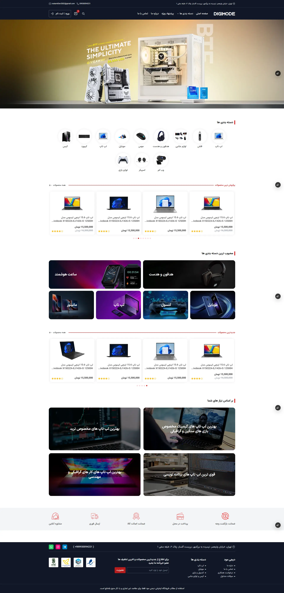
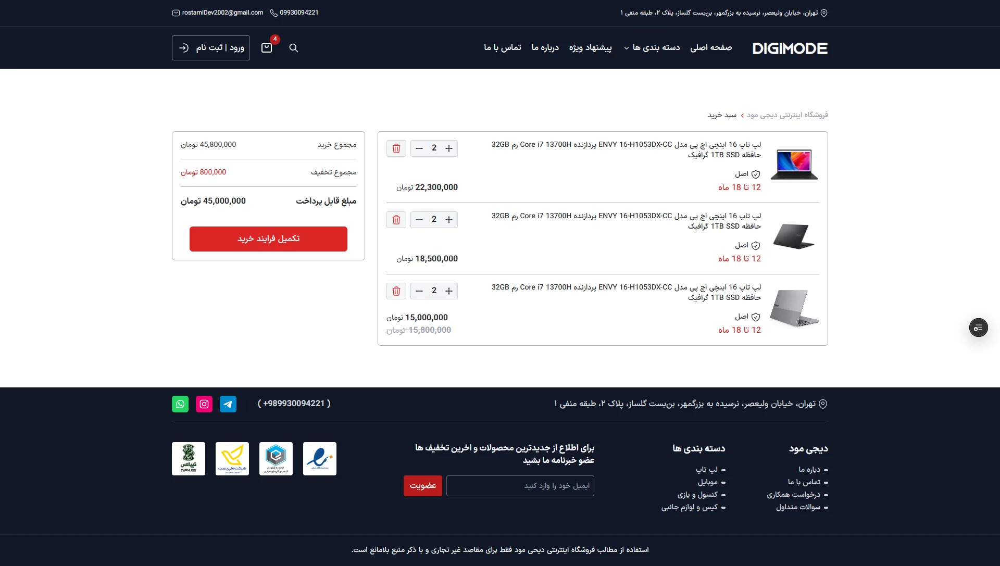
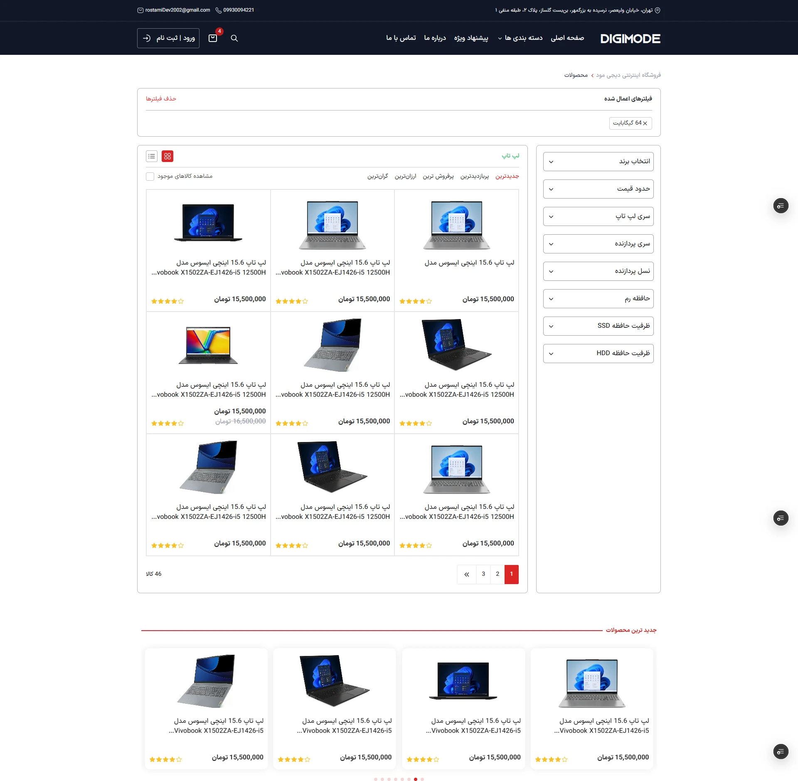
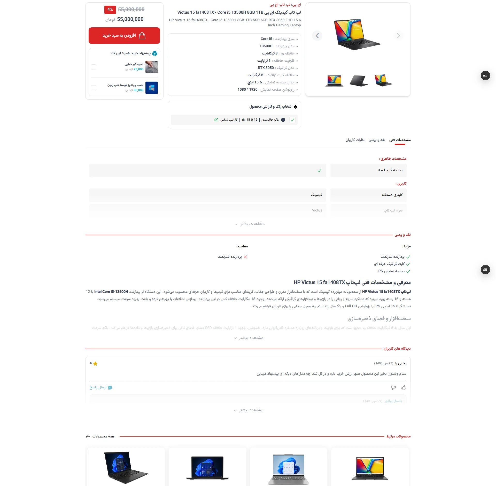

# Project Name
Digi Mode

## About
Digimode is a store site selling computers, laptops and theiraccessories. It
is one of my first portfolios and is fully responsiveand developed using
HTML , Tailwind Css , and JavaScript .

## Features
- My First Big Project With JavaScript
- Different pages
- Different Animations
- Responsive
- Attractive user interface

## Tech Stack
- Tailwind CSS
- Javascript
- HTML

## Screenshots
<p align="center">
  
  
  
  
</p>

## Requirements

- Node.js 18+
- npm 9+

## Installation

1. Clone the repository

```bash
git clone https://github.com/your-username/project-name.git
```

2. Navigate to the project directory

```bash
cd project-name
```

3. Install dependencies

```bash
npm install
```

4. Start the development server

```bash
npm run dev
```

5. Open your browser and visit

```txt
http://localhost:5173
```
## Folder Structure
```txt
public
├── fonts
├── images
├── manifest.json
└── robots.txt

src
├── Components
├── custom-styleSheet
├── Pages
├── Utils
├── App.css
├── App.js
├── Custom.css
├── data.js
├── reportWebVitals.js
├── index.css
├── index.js
├── setupTests.js
└── routes.js
└── Symbols.jsx
```

## Live Demo
[Digi Mode](https://digimode.netlify.app)
